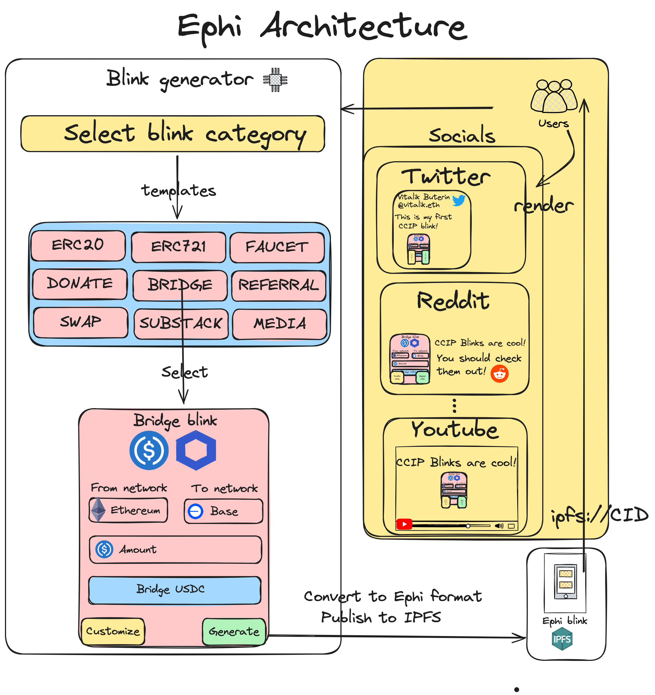

# 🌐 Ephi

## Introduction 🚀

Welcome to Ephi! Our mission is to bridge the gap between web3 users and everyday internet applications. Interacting with blockchain technology often requires isolated applications, which can be a significant barrier to adoption. Ephi breaks down these barriers by allowing users to create custom components using HTML and JavaScript. These components are then posted on IPFS and rendered by our extension whenever you post them, enabling blockchain interactions on any everyday application.

## How It Works 🔧

### Creating and Posting Components 🛠️

1. **Create Custom Components**: Use HTML and JavaScript to build your components.
2. **Post to IPFS**: Once created, post your components to IPFS for decentralized storage.
3. **Rendering**: Our extension automatically renders these components whenever they are posted.

You can use our Blink customized generator to easily create these components or make new ones from scratch to fit your specific needs.

### Interacting with Blockchain 💻

- **Seamless Integration**: Integrate blockchain interactions directly into your favorite apps without needing to switch to a different platform.
- **Customizable**: Tailor the components to fit your specific needs, whether it's for transactions, notifications, or any other blockchain-related activity.
- **Accessible**: Make blockchain technology accessible to everyone, not just crypto enthusiasts.

## Architecture Overview 🏗️



Ephi is built to seamlessly integrate with existing web technologies and the Ethereum and EVM chains. The architecture leverages the power of IPFS and modern web development practices to provide a robust and scalable solution.

### Components 🧩

### IPFS Storage 📦

- **Decentralized**: Store your components on the InterPlanetary File System (IPFS) for enhanced security and decentralization.
- **Reliable**: Ensure your components are always accessible and resistant to censorship.

### Browser Extension 🔗

- **Automatic Rendering**: Our browser extension renders your IPFS-stored components whenever you post them, making blockchain interactions effortless.
- **User-Friendly**: Designed to be intuitive and easy to use, even for those new to blockchain technology.

## Key Features 🌟
### Blockchain Interaction 🌐

- **On Any App**: Bring blockchain transactions and interactions to any web surface capable of displaying a URL.
- **Metadata-Rich Links**: Use shareable, metadata-rich links to enhance the user experience and enable more interactive functionalities.

## Conclusion 🌟

Ephi brings blockchain technology into everyday internet applications, making it accessible and easy to use for everyone. By leveraging the power of IPFS and customizable components, Ephi removes the barriers to blockchain adoption and opens up a world of possibilities for web3 interactions. Join us in revolutionizing the way we interact with the blockchain! 🚀

---

Feel free to reach out if you have any questions or want to contribute! 🌐💬


## Requirements

Before you begin, you need to install the following tools:

- [Node (v18)](https://nodejs.org/en/download/)
- [Git](https://git-scm.com/downloads)
- [Foundry](https://book.getfoundry.sh/getting-started/installation)

## Quick start

**Clone the Repository**

```bash
git clone git@github.com:Scannty/eth-blinks.git
```

### Setting Up Smart Contracts

1. Setup the environment

Create a .env file (see the .env.example)

2. Install Dependencies

```bash
cd blink-contracts/
forge install
```

3. Compile and Test Contracts

```bash
forge build
forge test
```

4. Deploy contracts

```bash
npx hardhat run scripts/deployReferralExample.ts --network $networkName
npx hardhat run scripts/deployTokenTransferor.ts --network $networkName
```

### Setting Up Backend

1. Setup the environment

Create a .env file (see the .env.example)

2. Install Dependencies

```bash
cd blink-back-end/
npm install
```

3. Run the server
```bash
node server.js
```

### Setting Up the Frontend

1. Install Dependencies

```bash
cd blinks-generator
npm install
```

2. Run App

```bash
npm start
```

### Add Extension

1. In browser extension window enable developer mode

2. Click on `load from unpacked` and select blink-extension folder

```bash
npm start
```

### Running Test Server(Optional)
1. Install Dependencies

```bash
cd blinks-test-server
npm install
```

2. Run App

```bash
node app.js
```

3. Use http://localhost/$routeName instead of IPFS
