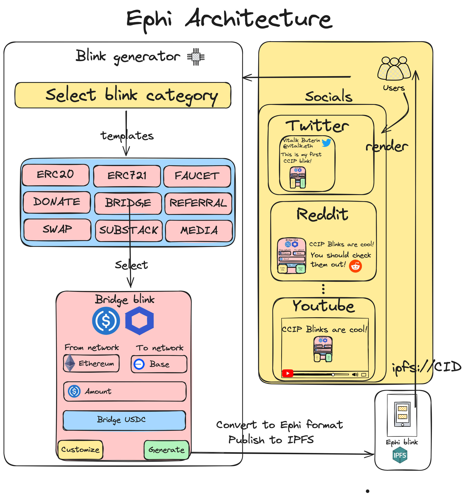

# 🌐 Ephi

## Introduction 🚀

Welcome to Ephi! Our mission is to bridge the gap between web3 users and everyday internet applications. Interacting with blockchain technology often requires isolated applications, which can be a significant barrier to adoption. Ephi breaks down these barriers by allowing users to create custom components using HTML and JavaScript. These components are then posted on IPFS and rendered by our extension whenever you post them, enabling blockchain interactions on any everyday application.

📜 Contracts are deployed and verified on the following networks:

- **Base Sepolia** 🟢

  - TokenTransferor: [`0x5E23A12Dd75Bb2432d40B4fc2f676603306a3ff8`](https://sepolia.basescan.org/address/0x5E23A12Dd75Bb2432d40B4fc2f676603306a3ff8)

- **Arbitrum Sepolia** 🟠

  - TokenTransferor:[`0x3f6ec2Ca69EBB445D11865B8BcA8Be1Dc184114d`](https://sepolia.arbiscan.io/address/0x3f6ec2Ca69EBB445D11865B8BcA8Be1Dc184114d)

- **Linea Sepolia** 🟤

  - Donations: [`0x3f6ec2Ca69EBB445D11865B8BcA8Be1Dc184114d`](https://sepolia.lineascan.build/address/address/0x3f6ec2Ca69EBB445D11865B8BcA8Be1Dc184114d)

- **NeonEVM** 🟣

  - Donations: [`0x3f6ec2Ca69EBB445D11865B8BcA8Be1Dc184114d`](https://devnet.neonscan.org/address/0x3f6ec2Ca69EBB445D11865B8BcA8Be1Dc184114d)

- **ApeChain Jenkins** 🔵
  - Donations:[`0x3f6ec2Ca69EBB445D11865B8BcA8Be1Dc184114d`](https://jenkins.explorer.caldera.xyz/address/0x3f6ec2Ca69EBB445D11865B8BcA8Be1Dc184114d)

- **Rootstock Testnet** 🔴

  - Donations:[`0x3f6ec2ca69ebb445d11865b8bca8be1dc184114d`](https://explorer.testnet.rootstock.io/address/0x3f6ec2ca69ebb445d11865b8bca8be1dc184114d)

- **Zircuit Testnet** ⚪

  - Donations:[`0x3f6ec2Ca69EBB445D11865B8BcA8Be1Dc184114d`](https://explorer.zircuit.com/address/0x3f6ec2Ca69EBB445D11865B8BcA8Be1Dc184114d)

- **Scroll Sepolia** 🟡

  - Donations:[`0x3f6ec2Ca69EBB445D11865B8BcA8Be1Dc184114d`](https://sepolia.scrollscan.com/address/0x3f6ec2Ca69EBB445D11865B8BcA8Be1Dc184114d)

- **Morph Holesky** 🔵

  - Donations:[`0x3f6ec2Ca69EBB445D11865B8BcA8Be1Dc184114d`](https://explorer-holesky.morphl2.io/address/0x3f6ec2Ca69EBB445D11865B8BcA8Be1Dc184114d)

## How It Works 🔧

### Creating and Posting Components 🛠️

1. **Create Custom Components**: Use HTML and JavaScript to build your components.
2. **Post to IPFS**: Once created, post your components to IPFS for decentralized storage.
3. **Rendering**: Our extension automatically renders these components whenever they are posted.

You can use our Blink customized generator to easily create these components or make new ones from scratch to fit your specific needs.

### Interacting with Blockchain 💻

- **Seamless Integration**: Integrate blockchain interactions directly into your favorite apps without needing to switch to a different platform.
- **Customizable**: Tailor the components to fit your specific needs, whether it's for transactions, notifications, or any other blockchain-related activity.
- **Accessible**: Make blockchain technology accessible to everyone, not just crypto enthusiasts.

## Architecture Overview 🏗️



Ephi is built to seamlessly integrate with existing web technologies and the Ethereum and EVM chains. The architecture leverages the power of IPFS and modern web development practices to provide a robust and scalable solution.

### Components 🧩

### IPFS Storage 📦

- **Decentralized**: Store your components on the InterPlanetary File System (IPFS) for enhanced security and decentralization.
- **Reliable**: Ensure your components are always accessible and resistant to censorship.

### Browser Extension 🔗

- **Automatic Rendering**: Our browser extension renders your IPFS-stored components whenever you post them, making blockchain interactions effortless.
- **User-Friendly**: Designed to be intuitive and easy to use, even for those new to blockchain technology.

## Key Features 🌟

### Blockchain Interaction 🌐

- **On Any App**: Bring blockchain transactions and interactions to any web surface capable of displaying a URL.
- **Metadata-Rich Links**: Use shareable, metadata-rich links to enhance the user experience and enable more interactive functionalities.

## Conclusion 🌟

Ephi brings blockchain technology into everyday internet applications, making it accessible and easy to use for everyone. By leveraging the power of IPFS and customizable components, Ephi removes the barriers to blockchain adoption and opens up a world of possibilities for web3 interactions. Join us in revolutionizing the way we interact with the blockchain! 🚀

---

Feel free to reach out if you have any questions or want to contribute! 🌐💬

## Requirements

Before you begin, you need to install the following tools:

- [Node (v18)](https://nodejs.org/en/download/)
- [Git](https://git-scm.com/downloads)
- [Foundry](https://book.getfoundry.sh/getting-started/installation)

## Quick start

**Clone the Repository**

```bash
git clone git@github.com:Scannty/eth-blinks.git
```

### Setting Up Smart Contracts

1. Setup the environment

Create a .env file (see the .env.example)

2. Install Dependencies

```bash
cd blink-contracts/
forge install
```

3. Compile and Test Contracts

```bash
forge build
forge test
```

4. Deploy contracts

```bash
npx hardhat run scripts/deployReferralExample.ts --network $networkName
npx hardhat run scripts/deployTokenTransferor.ts --network $networkName
```

### Setting Up Backend

1. Setup the environment

Create a `.env` file (see `.env.example`). Get a JWT (or an API key + secret) from [Pinata](https://app.pinata.cloud/developers/api-keys). Without it, the generator's **Deploy** button can't publish blinks to IPFS.

For the Uniswap blink on X, also set `UNISWAP_API_KEY` (free key from the [Uniswap developer dashboard](https://developers.uniswap.org/dashboard)). The extension asks the backend for quotes and swap transactions, so the key never ships in the extension.

2. Install Dependencies

```bash
cd blink-back-end/
npm install
```

3. Run the server (port 8000, override with `PORT`)

```bash
node server.js
```

Open http://localhost:8000 to check that your Pinata credentials work.

### Setting Up the Frontend

1. Install Dependencies

```bash
cd blink-generator
npm install
```

2. Run App (http://localhost:3000)

```bash
npm start
```

The generator talks to the backend at `http://localhost:8000`. Set `REACT_APP_BACKEND_URL` to use a different one.

### Add Extension

The extension uses Manifest V3. Each blink renders in a sandboxed iframe, and its wallet calls are forwarded to your browser wallet (e.g. MetaMask) on the page.

1. Open `chrome://extensions` and enable **Developer mode**
2. Click **Load unpacked** and select the `blink-extension` folder
3. After changing extension code, click the reload icon on the extension card and refresh the page

Blinks render on x.com and on `localhost` pages.

**Uniswap blink on X:** supported tickers on X (`$ETH`, `$BTC`, `$UNI`, `$LINK`, `$AERO`, …) get a small **Buy** pill under their ticker card. Pressing it opens a swap panel that quotes and executes the swap on **Base mainnet** through the Uniswap Trading API. These are real swaps with real funds. The backend must be running with `UNISWAP_API_KEY` set.

### Running Test Server (Optional)

1. Install Dependencies

```bash
cd blink-test-server
npm install
```

2. Run App (port 8080, override with `PORT`)

```bash
node app.js
```

3. Open http://localhost:8080/feed to see the example blinks rendered by the extension, or use `<blk http://localhost:8080/$routeName blk>` (`swap`, `bridge`, `donation`, `faucet`) instead of an IPFS link
